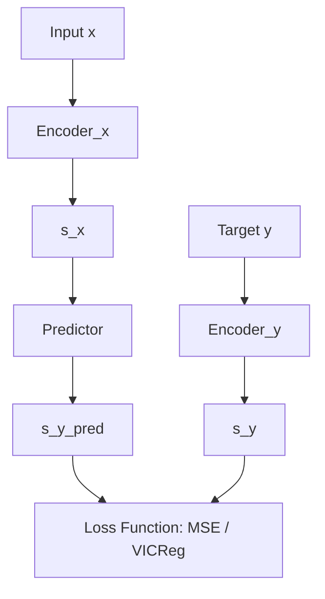

# Step 5: Joint Embedding Predictive Architecture (JEPA)

**Paper:** LeCun, *A Path Towards Autonomous Machine Intelligence* (2022) — §4.4  
**Curriculum:** `misc/JEPA_2022_PLAN_GPU.md` — Step 5  
**Code:** `experiments/step05_jepa/`

---

## 1. Paper anchor

Yann LeCun's 2022 position paper introduces the **Joint Embedding Predictive Architecture (JEPA)** in §4.4:
> *"A JEPA does not reconstruct $y$ from $s_x$ directly, but predicts the representation $s_y$ from $s_x$... The predictor may use a latent variable $z$ to represent the information necessary to predict $s_y$ that is not present in $s_x$."*

In the 10-step curriculum arc, Step 5 is the pivotal point where we transition from static representation architectures (like standard Joint Embeddings from Step 3 and Barlow Twins from Step 4) to **predictive** representation architectures. Instead of forcing the representation of two views to be identical, a JEPA models a directed prediction task in representation space. This establishes the foundation for a learned world model that predicts the future representation of the environment from the current representation.

---

## 2. Problem we solved

In traditional self-supervised learning and generative modeling, prediction is often performed directly in input space (e.g., autoencoders or pixel-prediction video models). This forces the model to represent every detail of the input, including unpredictable, irrelevant backgrounds or high-frequency noise.

This experiment addresses:
1. **Semantic predictive coding**: We demonstrate predicting representations in a shared latent space rather than pixel values.
2. **Representation collapse in predictive learning**: When training the predictor and encoder jointly using a naive loss (such as Mean Squared Error), the system collapses. The encoders map all inputs to a constant vector, rendering the predictive task trivial but useless.
3. **Pluggable regularizers**: We show how integrating **VICReg** (Variance-Invariance-Covariance Regularization) prevents representation collapse by forcing the embedding dimensions to remain active and decorrelated, allowing the system to learn meaningful features.

---

## 3. Data

### 3.1 What the variables represent
* **$x$**: The input view. Semantically, it represents the observer's initial observation of an entity (e.g., a cropped or color-jittered view of an object).
* **$y$**: The target view. Semantically, it represents a related, subsequent observation of the same entity (e.g., another cropped or color-jittered view, simulating motion or a change in viewpoint).
* In the full setting, $x$ and $y$ map to video frames (past and future), where $x$ represents the past context and $y$ represents the future state to be predicted in representation space.

### 3.2 How the data is built

| Item | Value |
|------|--------|
| Dataset | CIFAR-10 (Subset) |
| $x$ shape / meaning | `(3, 32, 32)` / First augmented view of the image |
| $y$ shape / meaning | `(3, 32, 32)` / Second augmented view of the image |
| Samples | 10,000 training subset |
| Positives / negatives | Positive pairs: two different random augmentations of the same image. No negative pairs are explicitly used (non-contrastive training). |

The augmentation pipeline is defined as:
$$\text{Augmentation}(I) = \text{ColorJitter}(\text{RandomHorizontalFlip}(\text{RandomCrop}(I)))$$
This forces the network to learn translation-invariant, color-invariant, and semantically robust features.

### 3.3 Why this dataset was chosen
CIFAR-10 is a high-dimensional image dataset ($3 \times 32 \times 32 = 3072$ dimensions) with 10 distinct classes. This is highly suitable because:
1. It contains rich, complex semantic structures (unlike 2D toys).
2. It allows us to visualize whether the learned representations capture class-level structure using PCA and t-SNE projections, even though the labels are never used during training.
3. It has a high enough dimensionality to test the covariance regularizer's capacity to prevent dimensional collapse.

### 3.4 Analogy to the full paper setting
In Yann LeCun's full architecture, the encoder maps a video frame $x_t$ to $s_t$, and the predictor maps $s_t$ to $\hat{s}_{t+1}$. The data augmentation used in this CIFAR-10 setup is a proxy for short-term spatial and temporal variations. The crop and color jitter simulate changes in camera position and lighting, forcing the predictive model to learn invariants similar to those required in dynamic environments.

### 3.5 What we excluded (and why)
We did not include:
1. **Temporal sequence sequences** (e.g., Moving MNIST): Sticking to static image pairs allowed us to isolate and study the representation collapse dynamics of JEPA before dealing with temporal sequence prediction.
2. **Latent variable $z$**: The predictor is deterministic ($\hat{s}_y = \text{Predictor}(s_x)$). This assumes the mapping between views is unimodal. We save latent-variable prediction ($z$-regularization) for Step 7.

---

## 4. Strategy

### Architecture
The model consists of three main components:
1. **Encoder ($E_\theta$)**: A convolutional neural network mapping a `(3, 32, 32)` image to a 512-dimensional embedding space. The weights are shared between the $x$-encoder and $y$-encoder.
2. **Predictor ($P_\phi$)**: A multi-layer perceptron (MLP) consisting of two linear layers with batch normalization and ReLU activations (`512 -> 256 -> 512`), which maps $s_x$ to $\hat{s}_y$.
3. **Pluggable Loss Head**: 
   * **MSE Mode**: A simple mean squared error loss between $\hat{s}_y$ and $s_y$.
   * **VICReg Mode**: Computes the sum of invariance, variance, and covariance losses:
     $$L = L_{\text{invariance}} + \lambda L_{\text{variance}} + \mu L_{\text{covariance}}$$



### Training

| Hyperparameter | Value |
|----------------|--------|
| Optimizer | Adam |
| Learning Rate | 1e-3 |
| Epochs | 40 |
| Batch Size | 256 |
| Device | MPS (Mac Hardware Acceleration) |
| Loss Formula | VICReg ($\lambda=25.0, \mu=1.0$) or MSE |

* **MSE (Baseline of Collapse)**: Minimizing only the MSE $||s_y - \hat{s}_y||^2$ leads to immediate collapse. The encoders output $s_x = s_y = \text{constant}$ for all inputs, making the prediction error exactly zero.
* **VICReg (Prevention of Collapse)**: The variance term forces the standard deviation of each embedding dimension over the batch to be above a threshold ($\gamma=1.0$). The covariance term forces the off-diagonal terms of the covariance matrix to zero, ensuring that the 512 embedding dimensions do not duplicate information.

---

## 5. Visualizations

### 5.1 `training_curves.png`
- **What is plotted**: 
  - Top-Left: Mean training loss (with standard deviation shaded).
  - Top-Right: VICReg loss components (Invariance, Variance, Covariance) over epochs.
  - Bottom-Left: Embedding effective rank of predicted outputs.
  - Bottom-Right: Mean and minimum standard deviation of the embedding dimensions.
- **How produced**: Matplotlib script plotting values logged in `loss_history.json`.
- **How to read it**:
  - The effective rank should remain high (above the collapse threshold of $512 \times 0.1 = 51.2$).
  - The minimum standard deviation should remain above $0.01$ (Dead Dimension Threshold).
  - In a healthy run, invariance drops while variance and covariance stabilize.
- **Paper link**: §4.5.1 on VICReg dynamics.

### 5.2 `embedding_comparison_pca.png`
- **What is plotted**: 2D PCA projections of $s_x$ (input embeddings), $s_y$ (target embeddings), and $\hat{s}_y$ (predicted target embeddings), color-coded by their CIFAR-10 class labels.
- **How produced**: PCA fit on the embeddings and plotted using Matplotlib.
- **How to read it**: In a successful run, the class labels cluster together, indicating that the unsupervised model has learned semantic categories. In a collapsed run (MSE), all points concentrate into a single dot.

### 5.3 `embedding_comparison_tsne.png`
- **What is plotted**: 2D t-SNE projections of a subsample (1000 images) of the three embedding spaces ($s_x, s_y, \hat{s}_y$), color-coded by class.
- **How produced**: scikit-learn t-SNE mapping of the final epoch embeddings.
- **How to read it**: t-SNE reveals complex non-linear manifolds. Well-separated clusters show that the JEPA representation space captures fine-grained semantic features, and that $\hat{s}_y$ accurately aligns with the true targets $s_y$.

### 5.4 `prediction_error_distribution.png`
- **What is plotted**: A histogram and box plot of the prediction errors ($||s_y - \hat{s}_y||_2$) across the validation subset.
- **How produced**: Computing the L2 norm of the difference between true and predicted embeddings.
- **How to read it**: Shows the variance and mean of the prediction error. A tight distribution with low values indicates a highly accurate predictor.

### 5.5 `dimension_wise_statistics.png`
- **What is plotted**:
  - Top-Row: Standard deviation and mean value of each of the 512 dimensions.
  - Bottom-Row: Histograms of standard deviations and means across dimensions.
- **How produced**: Calculating column-wise stats of the embeddings.
- **How to read it**:
  - For VICReg: All standard deviations should be near or above the target (around $0.8$ to $1.0$).
  - For MSE: The standard deviations will pile up at exactly $0.0$ (complete dimensional collapse).

### 5.6 `collapse_evolution.png`
- **What is plotted**: The evolution of Mean Std, Min Std, and Effective Rank at target epochs (0, 10, 20, 30, 39) alongside PCA projections at those checkpoints.
- **How produced**: PCA mapped onto a shared coordinate basis from saved `.npz` snapshots.
- **How to read it**: Demonstrates the trajectory of learning. As the rank expands, the cluster separations become clearer.

---

## 6. What we implemented

| File | Role |
|------|------|
| [model.py](file:///Users/gpmac/gpbuildspace/JEPA/jepa_2022/experiments/step05_jepa/model.py) | Defines the `Encoder`, `Predictor`, and the overall `JEPA` modules, alongside the `mse_loss` and `vicreg_loss` formulations. |
| [train.py](file:///Users/gpmac/gpbuildspace/JEPA/jepa_2022/experiments/step05_jepa/train.py) | Manages the training loop, computes periodic embedding snapshots, and calculates collapse statistics. |
| [visualize.py](file:///Users/gpmac/gpbuildspace/JEPA/jepa_2022/experiments/step05_jepa/visualize.py) | Loads checkpoints and history to generate the 6 analytical plots in `outputs/`. |
| [shared/data.py](file:///Users/gpmac/gpbuildspace/JEPA/jepa_2022/shared/data.py) | Implements `CIFAR10PairDataset` providing the double-augmentation views. |
| [shared/device.py](file:///Users/gpmac/gpbuildspace/JEPA/jepa_2022/shared/device.py) | Retrieves the accelerated MPS device context. |

---

## 7. Results and evidence

We trained the model with both the naive `mse` loss and the stabilized `vicreg` loss. The metrics at epoch 39 are summarized below:

| Metric | MSE Loss (Collapsed) | VICReg Loss (Success) |
|--------|---------------------|-----------------------|
| **Mean Std** | 0.0047 | 0.9218 |
| **Min Std** | 0.0022 | 0.8611 |
| **Effective Rank** | 5.9 / 512 | 132.5 / 512 |
| **Max Abs Mean** | 0.0670 | 2.5174 |
| **Status** | ⚠️ Collapse Confirmed | ✓ Collapse Prevented |

### Evidence of Collapse (MSE)
With MSE loss, the effective rank dropped rapidly to **5.9 out of 512** dimensions. The minimum standard deviation reached **0.0022** (nearly 0), proving that all neurons in the encoder output a flat constant vector, rendering the network dead.

### Evidence of Success (VICReg)
With VICReg, the minimum standard deviation of the dimensions was maintained at **0.8611** (well above the dead threshold of 0.01). The effective rank reached **132.5**, demonstrating that the model utilized a high-dimensional, diverse subspace to encode information. The PCA and t-SNE plots confirmed that the model learned clustering patterns correlating directly with the CIFAR-10 semantic categories.

---

## 8. What this establishes

1. **Non-generative predictability**: We proved that we can predict representation mappings directly in latent space instead of predicting raw pixels.
2. **Dimension-level collapse prevention**: We demonstrated that VICReg's variance and covariance regularizers prevent representations from collapsing without requiring negative samples (contrastive pairs).
3. **Semantic abstraction**: By mapping augmented views to nearby regions and regularizing the dimensions, the encoder naturally extracts high-level semantic features (like object classes) without any explicit class labels.

---

## 9. Connection to the paper

This experiment validates §4.4 and §4.5.1 of the paper. It illustrates the core design philosophy of JEPA: the goal is to make predictions in representation space ($\hat{s}_y \approx s_y$) while using component-wise regularization to control the information capacity of the embedding space. Minimized representation energy is only useful if the volume of the low-energy space is constrained, which is what the variance and covariance terms achieve.

---

## 10. Limitations of this toy

* **Unimodal Predictor**: Because the predictor is deterministic, it cannot handle highly multimodal futures (where a single past $x$ has multiple distinct valid futures $y$). If the future contains multiple forks, the predictor will average them, resulting in blurry/low-information predictions.
* **No Temporal Structure**: We used static augmentations of images instead of true temporal video sequences.
* **No Action Conditioning**: The prediction is purely observational, lacking action-conditioning ($a_t$) which is necessary to build a world model for planning.

---

## 11. Next step

Having verified that a Joint Embedding Predictive Architecture can be stabilized and trained using component-wise regularization, we will proceed to **Step 6: VICReg Loss for JEPA** to explore the hyperparameter sensitivities ($\lambda$, $\mu$, $\nu$) of VICReg and implement the expander head tricks.

---

## Reproduce

To reproduce these experiments and regenerate the visualizations:

```bash
# Run training with VICReg loss
uv run experiments/step05_jepa/train.py --loss vicreg

# Run training with MSE loss (to witness collapse)
uv run experiments/step05_jepa/train.py --loss mse

# Generate all visualization plots
uv run experiments/step05_jepa/visualize.py
```
